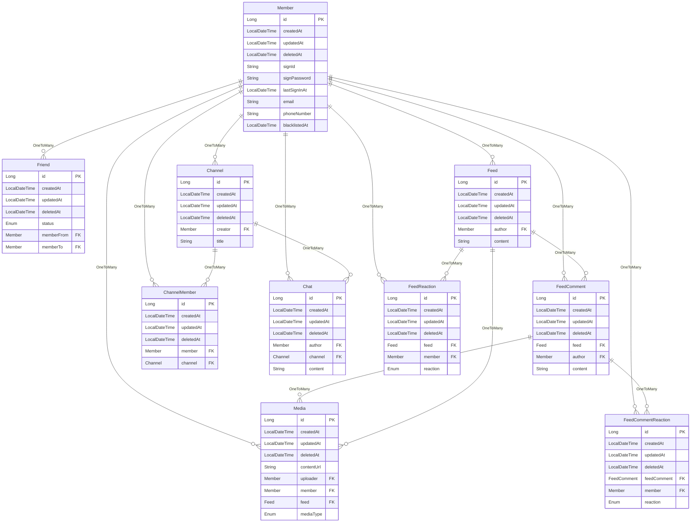

# Fakebook(Work in progress)

I wrote this in Korean as I'm currently short on time. If I have the time later, I'll rewrite it in English.

## Getting Started

Before getting started, OpenJDK 17 must be installed.

- Swagger: http://127.0.0.1:8080/swagger-ui/index.html
- Health Check: http://127.0.0.1:8080/actuator/health
- H2 Console: http://127.0.0.1:8080/h2-console

## Features
- 실시간 웹 소켓 기반 채팅
    - 채널 목록 조회, 생성, 삭제
    - 이전 채팅 불러오기
    - 채널 참여, 나가기
- 토큰 기반 인증
    - Refresh Token 리스트 조회, 삭제
    - Refresh Token을 통한 Access Token 갱신
- 무한 스크롤 가능한 피드
    - 모든 피드 가져오기, 피드 가져오기
    - 피드 생성, 수정, 삭제
    - 이미지, 동영상 미디어 추가
    - 댓글 조회, 추가, 삭제
    - 댓글에 이미지, 동영상 미디어 추가
    - 피드, 댓글 반응(좋아요, 슬퍼요, 웃겨요, 졸려요) 추가, 삭제
- 하나의 엔드포인트로 규격화된 미디어(이미지, 동영상) 업로드
- 멤버
    - 멤버 조회, 생성, 삭제, 정보 업데이트
    - 참여한 채널 전체보기
    - 패스워드 업데이트
    - 친구 리스트, 추가, 삭제

## Troubleshooting

### ID 기반 Cursor Pagination 이슈

커서 페이지네이션을 구현하다가 정렬 기준을 변경하니 페이지네이션 결과가 예상과 다른것을 확인하였습니다.

ID를 기준으로 정렬했을 때는 정상적인 데이터가 나왔는데, 정렬 기준을 title과 description으로 변경하니 예상치 못한 결과가 나타났습니다.

원인을 파악해보니, 비순차적인 데이터(title, description)를 기준으로 ASC(오름차순)으로 정렬할 때, 커서가 가리키는 엔티티 ID가 다음 페이지의 엔티티 ID보다 클 수 있다는 것이 문제였습니다.

예를 들어, ID가 2, 3, 1 순으로 정렬된 경우 커서가 2를 가리킨다면 1은 [entity.id](http://entity.id/) > 2 조건에 맞지 않아 조회되지 않습니다.

```sql
SELECT * FROM channel c0 WHERE c0.id > 2 ORDER BY c0.id ASC
```

ID가 순차적 이더라도 비순차적인 필드(e.g. description)를 기준으로 정렬하면 UUID 기반의 검색과 동일한 문제가 발생할 수 있다고 생각이 들었고, UUID 기반 커서 페이지네이션 문서를 찾아 보았습니다.

https://dba.stackexchange.com/questions/205384/mysql-uuid-created-at-cursor-based-pagination

위 답변을 보고 ID 하나만으로 검색하거나 정렬하는 것이 아니라는 것을 알았습니다.

정리하자면 정렬 필드가 다수 존재하는 커서 페이지네이션이 가져야 할 조건은 다음과 같습니다.

1. 데이터를 정렬하는데 사용된 필드를 기반으로 검색해야 합니다.
2. ID 는 중복된 데이터를 구별하기 위해 사용해야 합니다.(중복인경우 다중 정렬로 인해 다음 row 의 ID 는 현재 row ID 보다 크다는 것이 보장됩니다)
3. 다중 정렬을 사용하여 중복 데이터에 대해선 ID 값으로 정렬 해야 합니다.

```sql
// https://dev.mysql.com/doc/refman/8.0/en/row-constructor-optimization.html
// row constructor(인덱스 사용에 약간의 차이가 있지만 의미적으로 동일하다)
// (c2,c3) > (1,1)
// c2 > 1 OR ((c2 = 1) AND (c3 > 1))

SELECT * FROM channel c0
WHERE (c0.description, c0.id) > (x, y)
ORDER BY c0.description ASC, c0.id ASC;
```

row constructor 를 사용하지 않고 논리 연산자를 사용한다면 좀 더 이해가 수월합니다.

```sql
SELECT * FROM channel c0
WHERE c0.description > x OR (c0.description = x AND c0.id > y)
ORDER BY c0.description ASC, c0.id ASC
LIMIT 5
```

참고용 테이블

```sql
SELECT * FROM channel c0 ORDER BY c0.description ASC, c0.id ASC
---
ID  	CREATED_AT  	DELETED_AT  	UPDATED_AT  	DESCRIPTION  	TITLE  	CREATOR_ID  
3	2024-01-08 07:11:00.649913	null	2024-01-08 07:11:00.649913	1	2	1
4	2024-01-08 07:11:00.649913	null	2024-01-08 07:11:00.649913	1	null	1
5	2024-01-08 07:11:00.649913	null	2024-01-08 07:11:00.649913	1	null	1
6	2024-01-08 07:11:00.649913	null	2024-01-08 07:11:00.649913	1	4	1
1	2024-01-08 07:10:47.494086	null	2024-01-08 07:10:47.494086	2	3	1
2	2024-01-08 07:10:57.439106	null	2024-01-08 07:10:57.439106	3	1	1
```

조금 더 응용해보면 아래와 같은 쿼리도 만들 수 있습니다.

```sql
// 채널 참여자 수 기준으로 정렬 및 페이지네이션
SELECT c0.id, c0.description, c0.title, COUNT(cm.id) FROM channel c0
LEFT JOIN channel_member cm on c0.id=cm.channel_id
GROUP BY c0.id
HAVING COUNT(cm.id) > 1 OR (COUNT(cm.id) = 1 AND c0.id > '3')
ORDER BY COUNT(cm.id) ASC, c0.id ASC
LIMIT 5
```

## ERD


